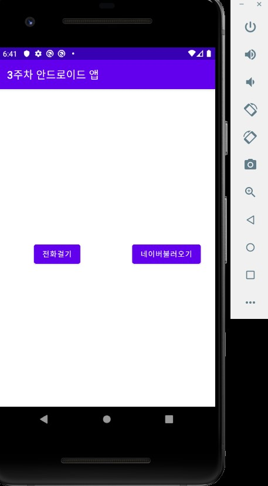
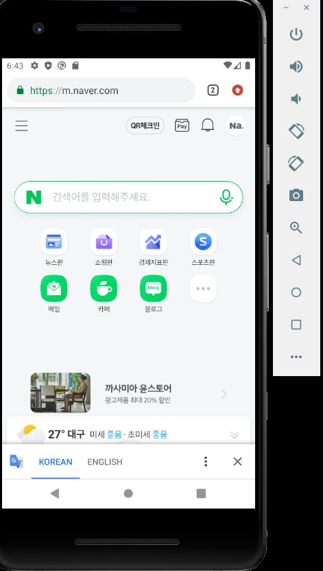
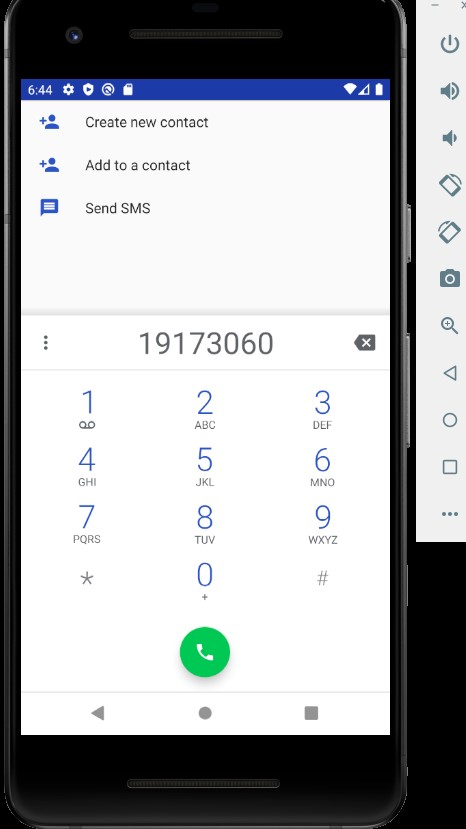
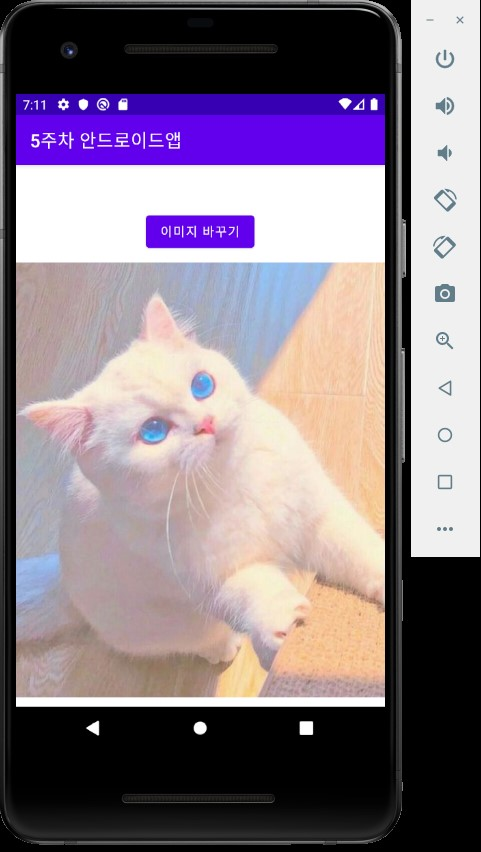
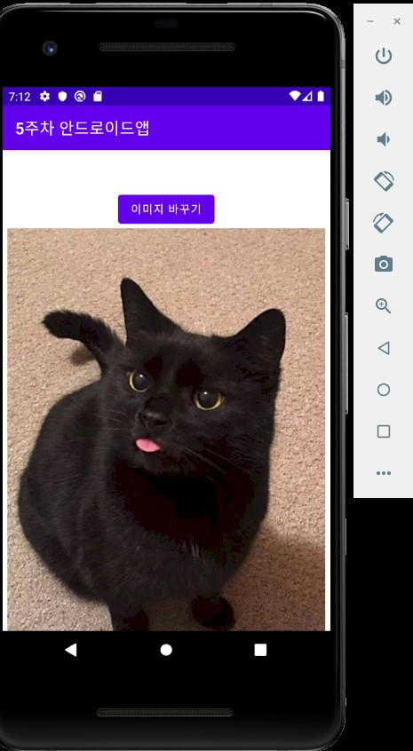
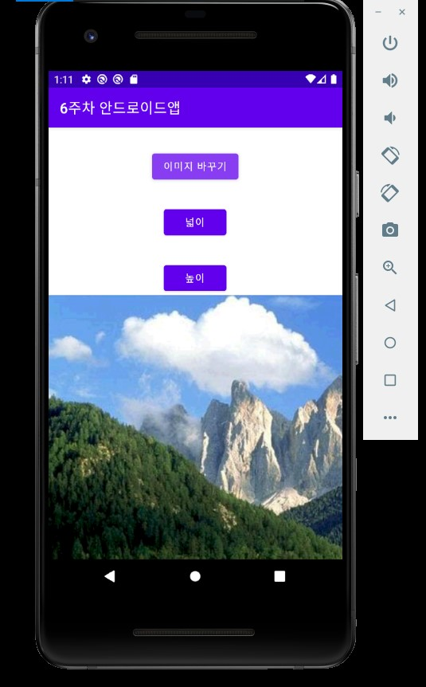
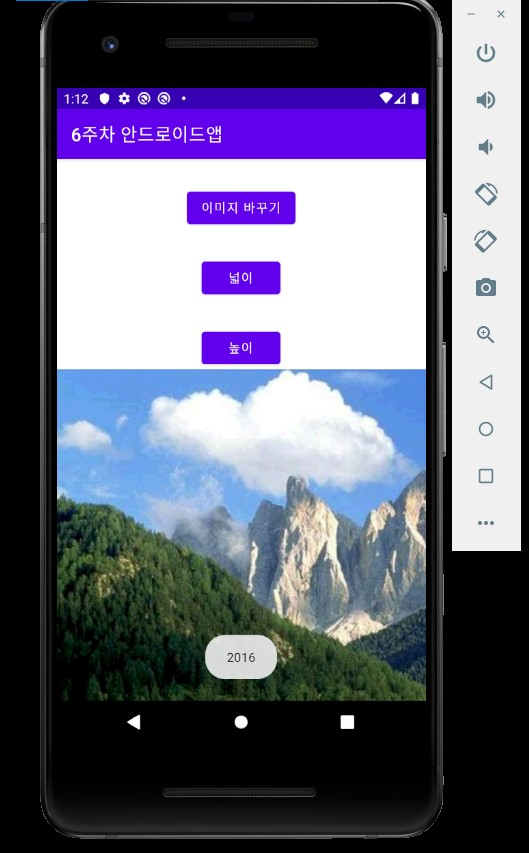
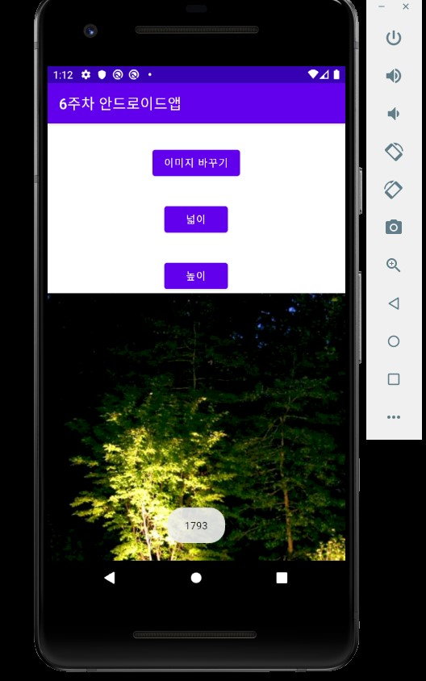
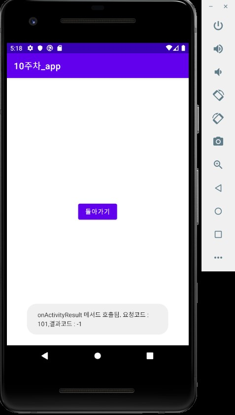
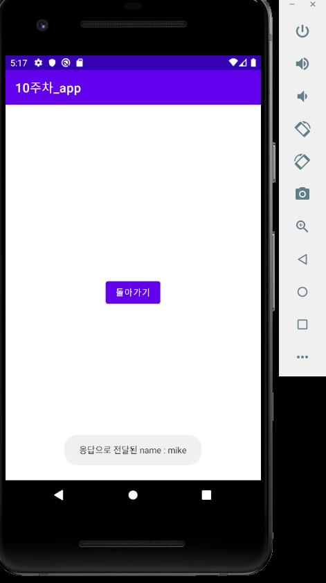

# 캡스톤디자인 안드로이드앱프로그래밍

## 1주차 

## 2주차
  - Github 사용법
  - 안드로이드앱 프로그래밍 시작
     - toast 알림
     - AVD 시작하기

 </img>
        
## 3주차
 - intent 활용
    - 네이버 화면(다른사이트 여도 상관없음)
    - 전화번호 입력창 화면( 본인 학번으로 입력) 

</img>

</img>

</img>

## 4주차
 - 아이디어 정리
    - 쇼핑몰이나 백화점에서 원하는 물건을 찾고 싶고, 원하는 브랜드, 가고 싶은 곳을 찾고 싶은데 못찾아서 찾으러 돌아다닌 경험은 누구나 있을 것이다. 에스컬레이터 근처에 floor plan이 있지만
    단순하게 적혀있고 대게 구체적이지 못하고 자신이 어디에 있는지도 모르는 경우가 다반사이다. 길이나 도로에서는 네비게이션이 있는데 왜 넓은 쇼핑몰이나 백화점에는 네비게이션이 없을까? 싶었다.     시간낭비를 줄이고 불편함을 감소시켜주는 쇼핑몰 네비게이션 앱이 있으면 편리하겠다고 생각했다.

## 5주차
 - 이미지 바꾸기 
 
 
</img>

</img>

## 6주차
 - 두개의 버튼을 추가 삽입
 
 
  </img>
  
  
   - width
   
   
   </img>
   
   - height
   
   
   </img>
   
   
   
 ## 9주차
- 상태드로어블 만들기

- 셰이프 드로어블 만들기 (버튼 배경) 

- 셰이프 드로어블 만들기 (배경색)

- 셰이프 드로어블 만들기 (layer-list)

    </img>

## 10주차
- 여러화면 만들고, 화면간 전환하기

  - 돌아가기
 
     </img>
    
  - 액티비티
    
     </img>
     
  - 메서드 호출
    
     </img>
       
   - 응답
    
     </img>
     
     
## 11주차

  -  웹으로 요청하기
     
  </img>
    
